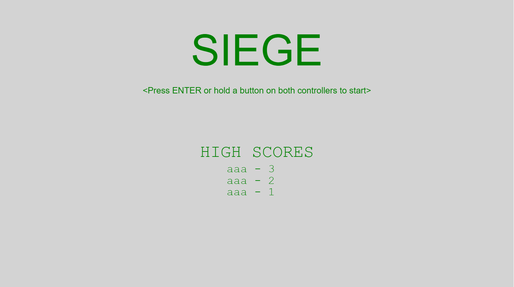

SIEGE is a simple web-based video game inspired by the popular classic, Space Invaders. The twist is that there is one player on each side of the screen (designed for the CreaTable, one player on each side of the table). The goal is to not die first. 

Lead by Dylan Kobayashi, we worked together to create this game as an educational exercise. All assets are original content.

I primarily programmed the game logic, which includes the collision detection, end conditions, score tracking, etc.

I had to work closely with the person working on the entities/objects, since I had to figure out what object functions I could use to pull data from. There were definitely some big miscommunications initially. We learned the importance of thorough documentation the hard way.

In the end, we completed the game with full controller support, and even unique AI behavior. This would be my first project in a team environment. It was a great learning experience on how to use Github (especially collaboratively), the importance of communication, and just general Javascript and HTML. 

<b>If you click on the image below, you can actually play the game in-browser.</b>

<b>Controls</b>

<u>Player 1 (left side)</u> 
W - Move up 
S - Move down 
D - Shoot 

<u>Player 2 (right side)</u> 
I - Move up 
K - Move down 
J - Shoot 

<a href="https://github.com/uhmlavalab/SIEGE"><i class="large github icon"></i>uhmlavalab/SIEGE</a>

